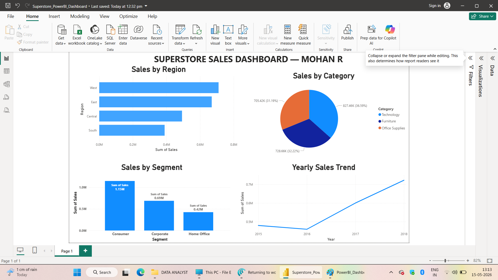

# Data Analyst Portfolio — Mohan R

## 👋 About Me
**BE + MTech in CSE | Data Analyst | Pondicherry, India**

I am a data analyst with expertise in **SQL, Power BI, Python, and Excel/Google Sheets**.
I help businesses turn raw data into clear, actionable dashboards and reports
that support faster and smarter decision-making.

📧 Available for freelance work on Upwork
🛠️ Tools: SQL | Power BI | Python (Pandas, Matplotlib) | Excel | Google Sheets

---

## 📁 Projects

---

### 1. Superstore Sales Analysis
**Tools Used:** Google Sheets | SQL | Python | Power BI

**Business Problem:**
A retail superstore wanted to understand which regions, categories,
and products were driving profits — and which were causing losses.

**Dataset:**
- Source: Kaggle Superstore Dataset
- Size: 9,994 rows | 21 columns
- Fields: Order Date, Region, Category, Sub-Category, Sales, Profit, Quantity, Discount

**What I Did:**
- Cleaned and explored the data using **SQL** (filtering, grouping, aggregating)
- Performed **Exploratory Data Analysis (EDA)** using **Python** (Pandas + Matplotlib)
- Built a **Google Sheets dashboard** for quick summary reporting
- Created an interactive **Power BI dashboard** with KPIs, filters, and drill-downs

**Key Insights:**
- 📍 **West region** generated the highest sales revenue
- 🪑 **Tables sub-category** had the highest losses despite decent sales volume
- 💡 **Technology category** had the best profit margins overall
- 📉 Heavy discounting above 30% consistently led to negative profit

**Project Files:**
| File | Description |
|------|-------------|
| [SuperStore_SQL_Project.sql](./SuperStore_SQL_Project.sql) | SQL queries for data cleaning and analysis |
| [SuperStore_Python_Project.ipynb](./SuperStore_Python_Project.ipynb) | Python EDA with charts and insights |
| [PowerBI_Dashboard.png](./PowerBI_Dashboard.png) | Power BI dashboard screenshot |
| [Google Sheets Dashboard](https://docs.google.com/spreadsheets/d/1mD8tOOy_lFLjZ8goKT5IZswukqION-kmIjecqqgRK-U/edit?usp=sharing) | Interactive spreadsheet dashboard |

**Power BI Dashboard Preview:**

---

## 🛠️ Skills

| Category | Tools |
|----------|-------|
| Dashboarding | Power BI, Google Sheets |
| Database | SQL (MySQL / PostgreSQL) |
| Programming | Python (Pandas, Matplotlib, Seaborn) |
| Spreadsheets | Excel, Google Sheets (Pivot Tables, Charts, Formulas) |
| Analysis | EDA, KPI Design, Data Cleaning, Data Transformation |

---

## 📬 Contact
- 💼 Upwork: *(https://www.upwork.com/freelancers/~01f1a46bcf0726b395?mp_source=share)*
- 📍 Location: Pondicherry, India
- 🕐 Availability: 12 hours/day | Open to freelance projects
